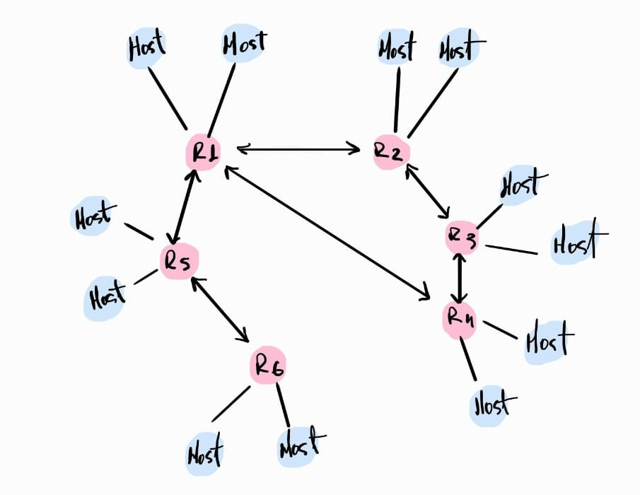

# Projeto de Redes - Protocolo Link-State com Docker

Este projeto inclui:

* **Roteamento Dinâmico (OSPF):** Implementação de um protocolo de roteamento OSPF para simular
a descoberta e atualização automática de rotas na rede.
* **Contêineres Docker:** Utilização de Docker para isolar e gerenciar cada roteador e host como 
um contêiner individual, facilitando a criação e o desmantelamento do ambiente de rede.
* **Testes de Conectividade:** Scripts para verificar a conectividade (`ping`) entre os hosts, 
validando o funcionamento do roteamento.
* **Análise de Desempenho:** Ferramentas e scripts para coletar e analisar métricas cruciais:
* **Tempo de Convergência:** Medição do tempo que a rede leva para se recuperar e restabelecer a 
conectividade após a ocorrência de falhas em roteadores.
* **Throughput de LSA:** Análise da capacidade de processamento de Link-State Advertisements (LSAs) 
pelos roteadores sob diferentes volumes de tráfego.
* **Uso de Recursos:** Monitoramento do consumo de CPU e memória dos contêineres de rede durante a 
simulação e sob carga.


## 📋 Como Executar o Projeto

### Pré-requisitos
- Docker instalado
- Docker Compose (normalmente incluso com Docker Desktop)

### 🚀 Execução

1. Clone o repositório:
   git clone [https://github.com/SamylleRose/trabalho_redes2_primeira_avaliacao.git]

2. Inicie a topologia:
   ```bash
   docker-compose up --build
   ```
3. Para testar a conectividade entre hosts:

    Para verificar a conectividade entre todos os hosts:
    ```bash
    python3 script/conexao_host.py
    ```
    Este script executará pings de cada host para todos os outros e reportará o status de 
    sucesso/falha e o tempo de resposta.


## 📡 Justificativa dos Protocolos Escolhidos

A seleção dos protocolos de rede para esta simulação foi uma decisão estratégica, 
visando demonstrar de forma eficaz os princípios de conectividade, resiliência e 
desempenho em um ambiente de rede dinâmico e complexo. A escolha recaiu sobre o 
**OSPF (Open Shortest Path First)** para o roteamento dinâmico e o **UDP (User Datagram Protocol)** 
como protocolo de transporte subjacente (para as mensagens OSPF), justificada pelos seguintes pontos:

### OSPF (Open Shortest Path First)

1.  **Protocolo Link-State:** O OSPF é um protocolo de estado de enlace, o que significa que cada roteador 
mantém uma visão completa e precisa da topologia da rede. Esta característica é fundamental para a 
simulação, pois permite:
    * **Cálculo de Rotas Otimizadas:** Utiliza o algoritmo de Dijkstra (SPF) para determinar os caminhos 
    mais curtos e eficientes para cada destino, garantindo o roteamento ideal na rede simulada.
    * **Observação Clara da Convergência:** Essencial para a análise do "Tempo de Convergência", pois a 
    reconstrução da topologia e o recálculo de rotas são transparentes e baseados em informações consistentes 
    entre todos os roteadores.

2.  **Convergência Rápida e Resiliência a Falhas:** O OSPF é conhecido por sua capacidade de reagir rapidamente a 
mudanças na topologia. Ao detectar uma falha (e.g., link ou roteador), ele propaga atualizações de estado de enlace (LSAs) 
rapidamente, permitindo que a rede recalcule as rotas e restabeleça a conectividade com agilidade. Isso é crucial para as 
métricas de resiliência que o projeto busca avaliar.

3.  **Escalabilidade e Ampla Adoção:** Apesar da escala da simulação, o modelo hierárquico do OSPF 
(através de áreas) demonstra sua robustez para redes maiores, conferindo relevância prática ao 
projeto, pois as dinâmicas observadas são aplicáveis a cenários de redes corporativas e de provedores de serviço.

### UDP (User Datagram Protocol)

A utilização do UDP para o transporte das mensagens OSPF (como os Link-State Advertisements - LSAs) é
 uma escolha otimizada e alinhada com as necessidades de um protocolo de roteamento dinâmico:

1.  **Eficiência e Baixo Overhead:**
    * **Protocolo Sem Conexão:** O UDP não exige o estabelecimento de uma conexão prévia (handshake), 
    o que elimina o overhead de configuração e encerramento de sessão presente no TCP.
    * **Leveza para Mensagens Frequentes:** As mensagens OSPF (especialmente os Hellos e LSAs) são 
    frequentemente pequenas e de natureza controlada pelo próprio protocolo de roteamento. O baixo 
    overhead do UDP garante que essas trocas de informação ocorram com a máxima eficiência, minimizando a latência.

2.  **Tolerância e Gerenciamento de Confiabilidade pelo OSPF:**
    * **Confiabilidade da Aplicação:** O OSPF, como protocolo de roteamento, implementa seus próprios mecanismos 
    robustos para garantir a entrega e a consistência das informações de roteamento (e.g., números de sequência 
    para LSAs, retransmissões internas, e acknowledgments para garantir a sincronização da base de dados).
    * A natureza inerentemente "não confiável" do UDP no transporte é, portanto, aceitável e até desejável, pois 
    evita uma duplicação desnecessária de mecanismos de confiabilidade que seriam impostos pelo TCP, introduzindo 
    latência e complexidade sem ganhos significativos.

3.  **Suporte Nativo a Multicast:**
    * O OSPF utiliza multicast (endereços como 224.0.0.5 e 224.0.0.6) para a descoberta de vizinhos e para a 
    inundação eficiente de atualizações de LSA dentro de uma área. O UDP é o protocolo de transporte ideal para 
    operações multicast, pois o TCP, sendo ponto-a-ponto, não as suporta nativamente.


## 🌐 Topologia da Rede





### Como a Topologia Foi Construída

A topologia desta simulação foi cuidadosamente projetada e implementada utilizando o 
**Docker Compose**, que permite definir e executar aplicações multi-container. 
Cada elemento da rede (roteador e host) é instanciado como um contêiner Docker 
separado, facilitando o isolamento e a configuração individual de cada nó.

Os principais componentes e técnicas utilizadas na construção da topologia são:

1.  **Contêineres Docker para Hosts e Roteadores:**
    * Cada **host** é representado por um contêiner Docker que executa um script Python (`host.py`). 
    Este script pode simular as funcionalidades básicas de um host, como a capacidade de enviar e receber pings.
    * Cada **roteador** é representado por um contêiner Docker que executa um script Python (`router.py`). 
    Este script é responsável por implementar a lógica do protocolo de roteamento dinâmico (OSPF), 
    gerenciando as tabelas de roteamento e trocando informações de rota com outros roteadores.

2.  **Redes Docker Personalizadas (Custom Docker Networks):**
    * Para simular sub-redes independentes e a interconexão entre roteadores, foram criadas 
    **redes Docker personalizadas**. 
    Cada segmento de rede, como a conexão entre um roteador e seus hosts, ou a conexão entre dois 
    roteadores, é uma rede Docker distinta.
    * Essas redes são definidas no arquivo `docker-compose.yml` com faixas de IP específicas 
    (e.g., `172.20.X.0/24`), garantindo que cada 
    interface de um contêiner esteja em sua sub-rede correta.

3.  **Configuração de Interfaces e IPs:**
    * Dentro do `docker-compose.yml`, cada serviço (host ou roteador) tem suas interfaces de rede 
    configuradas explicitamente para se conectar às redes Docker apropriadas.
    * Endereços IP estáticos são atribuídos a cada interface de cada contêiner (e.g., `ipv4_address: 172.20.1.11`), 
    replicando a configuração de uma rede física. Isso é crucial para o roteamento correto e
    para a operação do OSPF.

4.  **Protocolo OSPF (Open Shortest Path First):**
    * O OSPF foi escolhido como o protocolo de roteamento dinâmico. A lógica de seu funcionamento 
    (troca de Link-State Advertisements - LSAs, 
    cálculo da árvore de menor caminho, atualização da tabela de roteamento) é implementada nos scripts 
    Python dos roteadores.
    * A natureza "Link-State" do OSPF é ideal para demonstrar a convergência da rede e a resiliência a 
    falhas, pois todos os roteadores 
    constroem uma visão completa da topologia.

5.  **Arquivo `docker-compose.yml`:**
    * Este arquivo central orquestra toda a infraestrutura. Ele define:
        * Os serviços (contêineres de hosts e roteadores).
        * As imagens base (ou a construção de imagens a partir de Dockerfiles).
        * Os comandos de inicialização para cada contêiner (e.g., `python host.py` ou `python router.py`).
        * As redes Docker personalizadas e a atribuição de interfaces e IPs a cada contêiner.

